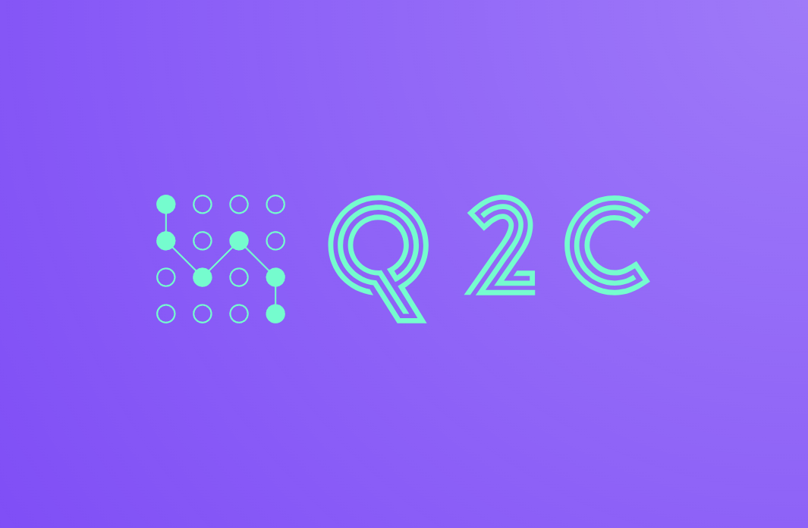
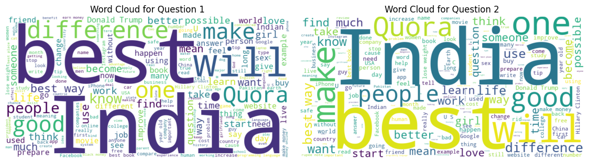
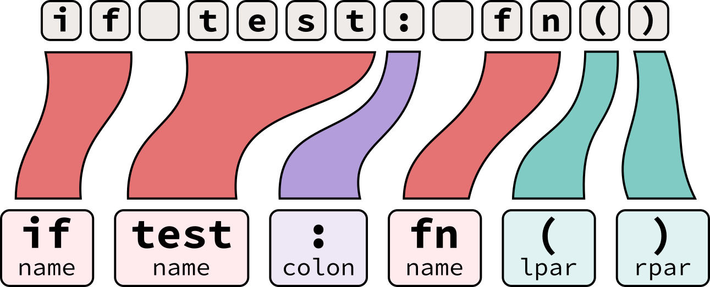
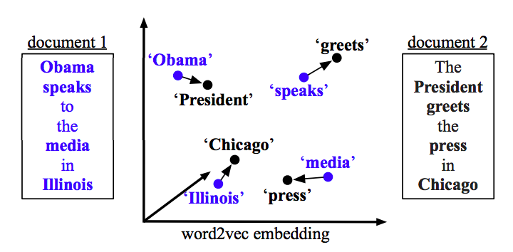

# **Quantum Query Comparator [Q2C]- Transcending textual boundaries, using semantic spheres**

## **Introduction**

 ---

  

Quantum Query Comparator (Q2C) is an innovative NLP chatbot designed to understand and compare the semantic essence of
user requests with a predefined question base. Instead of simple text matching, Q2C deepens the meaning of each query,
providing an accurate, contextually meaningful response each time.

## **Week I progress**

 ---

### Agenda:

- Problem statement & Road-map
- Team formation
- Data collection

### Problem statement & Road-map

In today's rapidly evolving digital landscape, users often seek immediate and accurate responses to their queries in
various domains, from customer support to educational platforms. Traditional systems rely on exact keyword matching to
retrieve and present information, which often falls short in understanding the user's intent, especially when questions
are paraphrased or posed differently. This leads to decreased user satisfaction and a lack of trust in automated support
systems.

Our challenge is to develop an intelligent chatbot, the Quantum Query Comparator (Q2C), capable of understanding the
semantic similarity between user-generated questions and a predefined set of questions in our database. This solution
should be able to go beyond mere textual overlaps and dive deep into the inherent meaning of the questions. The goal is
to ascertain whether two questions, despite being phrased differently, aim to seek the same information, thus enabling
the system to provide a more contextually relevant and accurate response. To successfully implement the project, we
created road-map:

- [x] *Preliminary Planning & Research:*
    - Team formation.
    - Identify the project's objectives and scope.
    - Research existing humor datasets and potential sources.

- [x] *Data Collection & Processing:*
    - Collect a more extensive set of questions and their paraphrases to train similarity models
    - Data cleaning: removing duplicates, correcting typos, etc.
    - Split the data into training, validation, and test sets.

- [x] *Model Selection & Prototyping:*
    - Choose baseline models (TF-IDF, Count Vectorizer)
    - Experiment with advanced models (Word Embeddings, BERT, RoBERTa)
    - Implement similarity scoring mechanisms (cosine similarity, Euclidean distance)

- [ ] *Training & Fine-tuning:*
    - Train the selected models using the training dataset
    - Fine-tune the models using transfer learning on the validation dataset

- [ ] *Evaluation & Testing:*
    - Evaluate the models using the test dataset
    - Calculate precision, recall, F1-score for similarity thresholding
    - Incorporate user feedback for iterative improvements

- [ ] *Deployment & Scalability:*
    - Deploy the model on a scalable platform (Telegram)
    - Monitor usage and ensure uptime and performance metrics are met

At the moment, *Preliminary Planning & Research* is fully completed. To find out the current status of the project, see
the marked items in road-map.

### Team Formation

The team was created on the basis of each member’s stack. Some additional roles had to be shared among the participants,
due to the small size of the team. You can see the table below with all members and their contacts:

| **Team Member** | Elina Akimchenkova                  | Ruslan Abdullin                                | Anatoliy Pushkarev                                |
|-----------------|-------------------------------------|------------------------------------------------|---------------------------------------------------|
| **Telegram ID** | [@akmchnkv](https://t.me/akmchnkv)  | [@Fliegende_Rehe](https://t.me/Fliegende_Rehe) | [@anatoliy_pus](https://t.me/anatoliy_pus)        |
| **Email**       | e.akimchenkova@innopolis.university | ru.abdullin@innopolis.university               | a.pushkarev@innopolis.university                  |
| **Role**        | Data engineer                       | ML engineer                                    | Quality Assurance Engineer Software Developer |

### Data collection

We started building data-sets using several sources:

- Public datasets: Kaggle Quora Dataset Release: Question Pairs
- Web scraping

Since we don’t have much time to collect data. Now we try to use special techniques to augment the data:

- Back-translation (translate anecdotes to another language and then translate it back to original).
- Paraphrasing tools (use tools to rephrase the anecdotes).

## **Week II progress**

 ---

### Agenda:

- Why the topic has changed
- Exploratory Data Analysis
- Data Engineering
- Model Selection

### Why the topic has changed

When our team came together in the first week, we were choosing project topics. We had two options: chatbot and anecdote
generator. The first one seemed to us very applied and payable. The second - interesting and difficult task. We
contacted people interested in integrating the chatbot into our services. We couldn’t get an answer fast enough, so we
went with the anecdote generator. We’ve been working on the project for about a week, and we already had the results
when potential customers contacted us. We were interested in selling the software, so we agreed to the offer. We are now
using our accessories, implemented in the first two weeks, in the new Q2C project.

### Exploratory Data Analysis (w1_exploratory_data_analysis.ipynb)

  

- **Ratio between Duplicate Question Pairs** helps in understanding the balance between duplicate and non-duplicate
  questions, which can guide data augmentation or balancing strategies for model training.

- **Distribution of Question Lengths** gives insights into the typical length of questions, aiding in optimizing
  sequence lengths for certain models and identifying outliers or potential data entry errors.

- **Analyzing Special Characters**  can help in data cleaning, and understanding if any specific characters play a
  significant role in distinguishing or categorizing questions.

- By understanding the usage of **Stopwords**, one can decide on their retention or removal in preprocessing steps,
  potentially improving model efficiency and accuracy.

- **Word Clouds for Questions** offer a quick and intuitive visualization of dominant words or themes in the dataset,
  aiding in preliminary data understanding.

- Identifying **Common Words in Questions** can help in understanding the core topics or themes in the questions,
  guiding
  feature engineering or thematic analysis.

- Understanding **Common Words between Question Pairs** can help in deducing semantic similarity and might hint at words
  that are essential in determining duplicates.

- **Unigrams Frequency Analysis** offers insights into the most prevalent terms and can guide token-based modeling
  approaches, as well as aid in refining data preprocessing techniques.

- **Unigrams Length Analysis** aids in identifying very short or very long words, which can be significant in certain
  contexts, and helps refine tokenization or preprocessing strategies.

As part of EDA we apply above techniques to our data. Each of these techniques serves to provide a deeper understanding
of the dataset's nature and characteristics, ensuring more informed decision-making during subsequent stages of the data
science process.

### Data Engineering (w2_data_engineering.ipynb)

  

- **Lowercasing** create a uniform representation of text and reduce the dimensionality of the data

- **Removing Stop Words** eliminate commonly used words (like 'and', 'the', 'is') that might not carry significant
  meaning in certain analytical contexts

- **Removing Punctuation Marks** strip out non-alphanumeric characters that might not be relevant in text analysis

- **Stemming** reduce words to their root/base form, thus consolidating words with similar meanings

- **Basic Typo Correction** fix inadvertent mistakes in text due to misspellings or typing errors

By employing above techniques, we are streamlining and refining the raw textual data, making it more amenable to
accurate and efficient analysis.

### Model Selection

Next week we decided to divide the tasks so that each of them will implement different models. Based on the results we
will choose the model with the highest scores. We investigated the issue and studied several options:

1. **Start with Baseline Models:** Baseline models provide a point of reference. They're generally simple and fast to
   implement.

    - TF-IDF with Cosine Similarity: Convert questions into TF-IDF vectors and then compute the cosine similarity
      between them

    - Count Vectorizer with Cosine Similarity: Similar to TF-IDF but based on raw term frequencies

2. **Word Embeddings:** Move towards more complex representations which capture semantic meaning more effectively than
   basic vectorizers

    - Word2Vec: Pre-trained (e.g., Google's model) or train your own on domain-specific data

    - FastText: Similar to Word2Vec but captures sub-word information

    - Doc2Vec: Extends Word2Vec to represent entire documents

    - Compute the cosine similarity between the embeddings of questions to determine similarity

3. **Use Advanced Pre-trained Models:** State-of-the-art models pre-trained on massive datasets can be fine-tuned for
   specific tasks

    - BERT (Bidirectional Encoder Representations from Transformers): Offers deep bidirectional representations

    - RoBERTa, DistilBERT, etc.: Variations of BERT with different training strategies or sizes

## **Week III progress**

 ---

### Agenda:

- Model Selection
- Training & Fine-tuning

### Model Selection (w3_model_selection)

  

We tried three model options:

- Baseline Models (Elina)
- Word Embeddings (Anatoliy)
- Pre-trained Models (Ruslan)

Results demonstrated that computing the cosine similarity between the embeddings of questions to determine similarity is
the best suited to our task. We will develop and improve this method.

### Training & Fine-tuning

Next week, we’ll divide the task again, and one person will continue to explore possible models. And two other members
of the team will be engaged in Training & Fine-tuning of the current solution. Next week plan:

- Preliminary Testing
- Model Sanity Checks
- Primary Evaluation Metrics
- Advanced Evaluation Metrics
- Error Analysis

## **Useful links**

 ---

- [GitHub link](https://github.com/Fliegende-Rehe/PMLDL_Q2C)  
