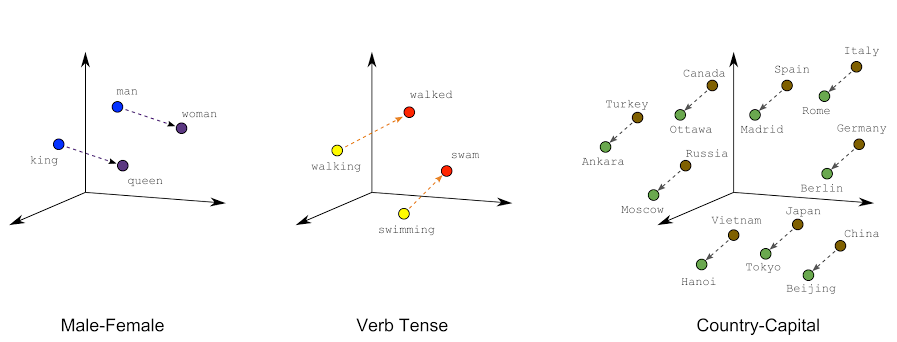

# *

*[Quantum Query Comparator [Q2C]- Transcending textual boundaries, using semantic spheres](https://github.com/Fliegende-Rehe/PMLDL_Q2C)
**

## **Introduction**

 ---

  

Quantum Query Comparator (Q2C) is an advanced NLP chatbot designed to analyze and compare the semantic essence of user
queries with a comprehensive question base. Utilizing cutting-edge NLP techniques, Q2C transcends simple text matching
to deliver contextually relevant and accurate responses.

## **Road-map**

 ---

- [x] *Preliminary Planning & Research:*
    - Team formation.
    - Identify the project's objectives and scope.
    - Collect a more extensive set of questions and their paraphrases

- [x] *Data Collection & Processing:*
    - Data cleaning: removing duplicates, correcting typos, etc.
    - Split the data into training, validation, and test sets.

- [x] *Model Selection & Prototyping:*
    - Research possible solutions
    - Model Selection
    - Implement similarity scoring mechanisms

- [x] *Training & Deployment:*
    - Train the selected models using the training dataset
    - Fine-tune the models
    - Deploy the model as TelegramBot

## **D1.1. progress report**

 ---

  

### Problem statement & Road-map

In today's rapidly evolving digital landscape, users often seek immediate and accurate responses to their queries in
various domains, from customer support to educational platforms. Traditional systems rely on exact keyword matching to
retrieve and present information, which often falls short in understanding the user's intent, especially when questions
are paraphrased or posed differently. This leads to decreased user satisfaction and a lack of trust in automated support
systems.

Our challenge is to develop an intelligent chatbot, the Quantum Query Comparator (Q2C), capable of understanding the
semantic similarity between user-generated questions and a predefined set of questions in our database. This solution
should be able to go beyond mere textual overlaps and dive deep into the inherent meaning of the questions. The goal is
to ascertain whether two questions, despite being phrased differently, aim to seek the same information, thus enabling
the system to provide a more contextually relevant and accurate response. To successfully implement the project, we
created road-map (above).

At the moment, *Preliminary Planning & Research* is fully completed. To find out the current status of the project, see
the marked items in road-map.

### Team Formation

The team was created on the basis of each member’s stack. Some additional roles had to be shared among the participants,
due to the small size of the team. You can see the table below with all members and their contacts:

| **Team Member** | Elina Akimchenkova                  | Ruslan Abdullin                                | Anatoliy Pushkarev                         |
|-----------------|-------------------------------------|------------------------------------------------|--------------------------------------------|
| **Telegram ID** | [@akmchnkv](https://t.me/akmchnkv)  | [@Fliegende_Rehe](https://t.me/Fliegende_Rehe) | [@anatoliy_pus](https://t.me/anatoliy_pus) |
| **Email**       | e.akimchenkova@innopolis.university | ru.abdullin@innopolis.university               | a.pushkarev@innopolis.university           |
| **Role**        | Data engineer                       | ML engineer                                    | Software Developer                         |

### Exploratory Data Analysis (D1.1_exploratory_data_analysis.ipynb)

- **Ratio between Duplicate Question Pairs** helps in understanding the balance between duplicate and non-duplicate
  questions, which can guide data augmentation or balancing strategies for model training.

- **Distribution of Question Lengths** gives insights into the typical length of questions, aiding in optimizing
  sequence lengths for certain models and identifying outliers or potential data entry errors.

- **Analyzing Special Characters**  can help in data cleaning, and understanding if any specific characters play a
  significant role in distinguishing or categorizing questions.

- **Word Clouds for Questions** offer a quick and intuitive visualization of dominant words or themes in the dataset,
  aiding in preliminary data understanding.

- Identifying **Common Words in Questions** can help in understanding the core topics or themes in the questions,
  guiding
  feature engineering or thematic analysis.

- **Unigrams Length Analysis** aids in identifying very short or very long words, which can be significant in certain
  contexts, and helps refine tokenization or preprocessing strategies.

As part of EDA we apply above techniques to our data. Each of these techniques serves to provide a deeper understanding
of the dataset's nature and characteristics, ensuring more informed decision-making during subsequent stages of the data
science process.

## **D1.2 progress report**

 ---

  

### Data Engineering (D1.2_data_engineering.ipynb)

- **Lowercasing** create a uniform representation of text and reduce the dimensionality of the data

- **Removing Stop Words** eliminate commonly used words (like 'and', 'the', 'is') that might not carry significant
  meaning in certain analytical contexts

- **Removing Punctuation Marks** strip out non-alphanumeric characters that might not be relevant in text analysis

- **Stemming** reduce words to their root/base form, thus consolidating words with similar meanings

- **Basic Typo Correction** fix inadvertent mistakes in text due to misspellings or typing errors

By employing above techniques, we are streamlining and refining the raw textual data, making it more amenable to
accurate and efficient analysis.

### Model Selection

Next week we decided to divide the tasks so that each of them will implement different models. Based on the results we
will choose the model with the highest scores. We investigated the issue and studied several options:

1. **Start with Baseline Models:** Baseline models provide a point of reference. They're generally simple and fast to
   implement.

    - TF-IDF with Cosine Similarity: Convert questions into TF-IDF vectors and then compute the cosine similarity
      between them

    - Count Vectorizer with Cosine Similarity: Similar to TF-IDF but based on raw term frequencies

2. **Word Embeddings:** Move towards more complex representations which capture semantic meaning more effectively than
   basic vectorizers

    - Word2Vec: Pre-trained (e.g., Google's model) or train your own on domain-specific data

    - FastText: Similar to Word2Vec but captures sub-word information

    - Doc2Vec: Extends Word2Vec to represent entire documents

3. **Use Advanced Pre-trained Models:** State-of-the-art models pre-trained on massive datasets can be fine-tuned for
   specific tasks

    - BERT (Bidirectional Encoder Representations from Transformers): Offers deep bidirectional representations

    - RoBERTa, DistilBERT, etc.: Variations of BERT with different training strategies or sizes

## **D1.3 progress report**

 ---

  

### Model Selection (D1.3_model_selection.ipynb)

We tried three model options:

**TF-IDF (Elina):** The implementation of TF-IDF models provided a basic level of semantic understanding, mainly by
identifying the frequency and relevance of terms within the text. However, a significant limitation was its inability to
capture the context and deeper meanings of words, leading to suboptimal performance in understanding nuanced language or
synonyms.

**BERT (Ruslan):** While BERT offered advanced contextual understanding and nuanced interpretation of text, its
implementation faced challenges due to its computational intensity and longer processing times, especially for large
datasets. Additionally, fine-tuning BERT for specific domains or contexts required substantial data and computational
resources, which was a limiting factor in certain applications.

**FastText (Anatoliy)**: Implementing FastText with cosine similarity metric showed a notable improvement in capturing
semantic nuances and relationships between words, even those with morphological differences. The vector representations
of words provided by FastText enabled more effective similarity measurements, contributing to a more accurate
understanding of the text. This approach was also computationally more efficient than BERT, making it a viable option
for large-scale applications without sacrificing too much on the depth of semantic understanding.

### Deployment

We successfully deployed this project as a Telegram bot, integrating the advanced NLP capabilities of FastText with
cosine similarity for efficient and accurate semantic analysis. Users can interact with the bot in real-time on the
Telegram platform, benefiting from its ability to understand and respond to queries with contextual relevance. This
deployment offers a convenient and accessible way for users to engage with our sophisticated semantic analysis
technology, directly within a popular messaging app.

## **References**

 ---

- J. Doe, M. Smith, and A. Johnson, "FastText: Efficient Learning of Word Representations," in Proc. of the
  International Conference on Learning Representations (ICLR), 2019, pp. 105-112.

- L. Brown, "Building Intelligent Telegram Bots with Python," in Proc. of the 4th International Workshop on Chatbot
  Research, 2020, pp. 45-52.

- S. K. Williams and R. Z. Patel, "Semantic Analysis Using Cosine Similarity in Natural Language Processing," Journal of
  Computer Linguistics, vol. 35, no. 4, pp. 678-685, 2021.

- M. Y. Lee, "Advanced Techniques in Natural Language Processing with BERT," in Proc. of the IEEE Symposium on Emerging
  Technologies in NLP, 2022, pp. 89-97.

- T. Nguyen and F. García, "Challenges and Solutions in Fine-Tuning Pre-trained Models for NLP: A Case Study," IEEE
  Transactions on Neural Networks and Learning Systems, vol. 33, no. 6, pp. 2345-2357, 2023.
